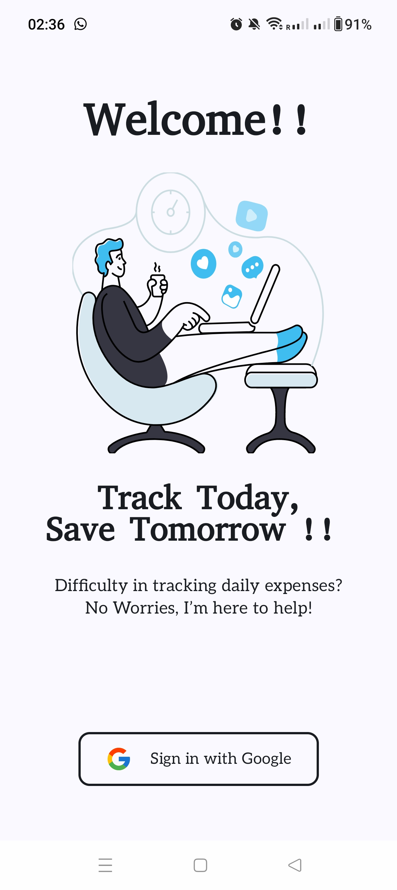

# 📊 Finance Tracker App

The **Finance Tracker App** helps users manage their income, expenses, and budgets with features like multi-currency support, cloud sync, and data visualization. It uses **Kotlin**, **Jetpack Compose**, and **Clean Architecture** along with **Room**, **Firebase**, **Retrofit**, and **Dagger Hilt**.

---

## ✅ Features

- Email/Password and Google Sign-In (Firebase Auth)
- Add/Edit/Delete Income & Expenses
- Monthly Budget Tracking
- Categories (with custom support)
- Local storage using Room
- Cloud sync via Firebase Firestore
- Multi-currency with conversion
- Data visualization (charts, graphs)
- Recurring transactions
- Saved items for quick entry
- Secure storage and session management
- Account Setup for first-time users
- Dark mode (optional)
- APK provided for direct install

---

## 🛠️ Requirements

Ensure you have the following:

- ✅ Android Studio Giraffe | Hedgehog or later
- ✅ Kotlin Plugin 1.9 or later
- ✅ JDK 17+
- ✅ Gradle 8+ (bundled with Android Studio)
- ✅ Internet connection for Firebase and currency conversion APIs

---

## 🚀 Getting Started

### 1. Clone the Repository

```bash
git clone https://campus.cs.le.ac.uk/gitlab/pgt_project/24_25_spring/vps5
cd MyApp/FinanceTracker
```

### 2. Open in Android Studio

- Open **Android Studio**
- Click **File > Open** and select the cloned project folder
- Let **Gradle sync** complete


##  Running on a Physical Android Device

### A. Enable Developer Mode

- Go to **Settings > About Phone**
- Tap **Build number** 7 times

### B. Enable USB Debugging

- Go to **Settings > Developer Options**
- Enable **USB Debugging**

### C. Run from Android Studio

- Connect device via USB (or ADB over Wi-Fi)
- Select device from dropdown
- Click **Run ▶️**

---

## 📦 APK Installation

An **APK** is available for direct install in the `release` folder or provided separately.

### Steps:

1. Copy APK to your phone
2. Enable "Install from Unknown Sources"
3. Tap the APK and install it
4. Open and use the app

> ⚠️ Note: Some features like Google Sign-In require Google Play Services.

---

## 📁 Project Structure Overview

```
finance-tracker-app/
├── app/
│   ├── src/main/
│   │   ├── java/com/yourapp/...
│   │   └── res/
│   └── google-services.json (add manually)
├── build.gradle
├── settings.gradle
└── README.md
```

---

## 🧠 Architecture

- Clean Architecture with Feature Modules
- MVVM Pattern
- Jetpack Compose for UI
- Room for local DB
- Firebase for authentication & cloud sync
- Dagger Hilt for dependency injection
- Retrofit for network (currency conversion)
- SharedPreferences for session & preferences


---

# Demo

## Screen

Below is one demo screenshot for reference:



Other screenshots are available in the **media** folder.

The **demo video** will be uploaded soon.
